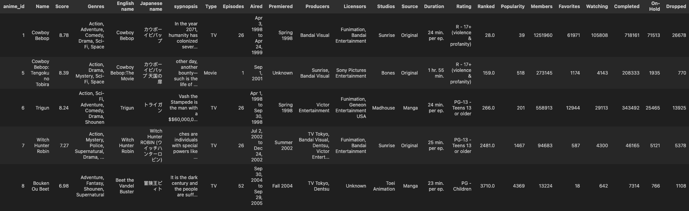
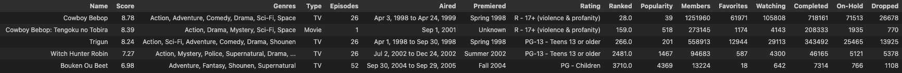
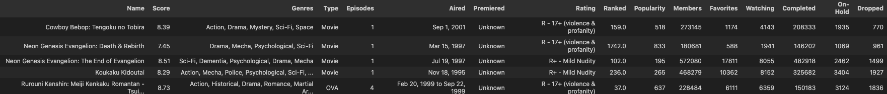
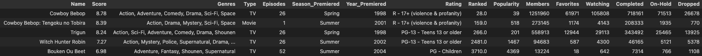
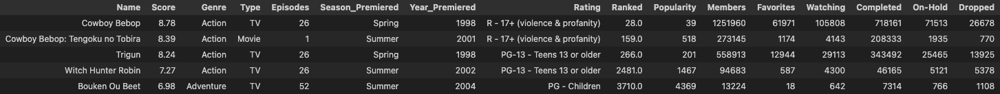
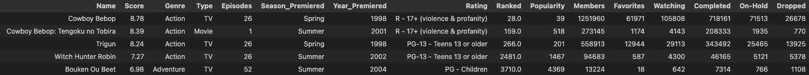
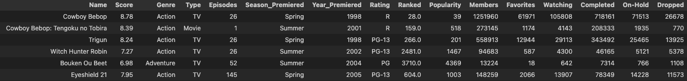
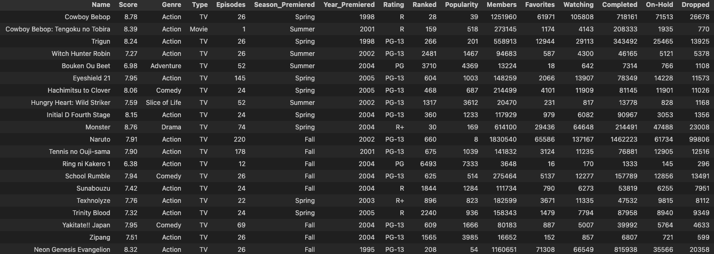

# Data Cleaning in Python

The purpose of the project is to clean a dataset in preparation for Creating Visualizations and EDA


## Data Set Used

 - [Anime Dataset 2023](https://www.kaggle.com/datasets/dbdmobile/myanimelist-dataset/data?select=anime-filtered.csv)
## Environment Used

- VM inside of VS Code running ```Python3```

- ```Jupyter Notebook``` inside of VS Code


## Libraries Used

- ```pandas```

## Some code snippets and pictures of the cleaning process 

- ### Table BEFORE cleaning \

- ### Table AFTER columns were \

- ### Querying the "Premiered" column for "Unknown" values \

- ### Table AFTER the "Premiered" column had been replaced by the "Season_Premiered" and	"Year_Premiered" column \

- ### Table BEFORE the "Genres" column was trimmed \

- ### Table AFTER the "Genres" column was trimmed \

- ### Table BEFORE the "Rating" column was trimmed \

- ### Table AFTER the "Rating" column was trimmed \

- ### Table AFTER cleaning \

